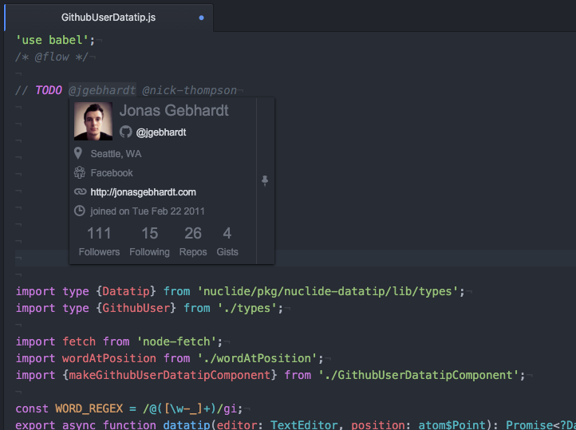

# Atom Package for GitHub user datatips

- uses the Nuclide datatip service API => requires the Nuclide package to be installed in Atom.
- does not require authentication with GitHub => is subject to rate-limiting.
- serves as an example of how to build Atom packages that consume Nuclide services.
